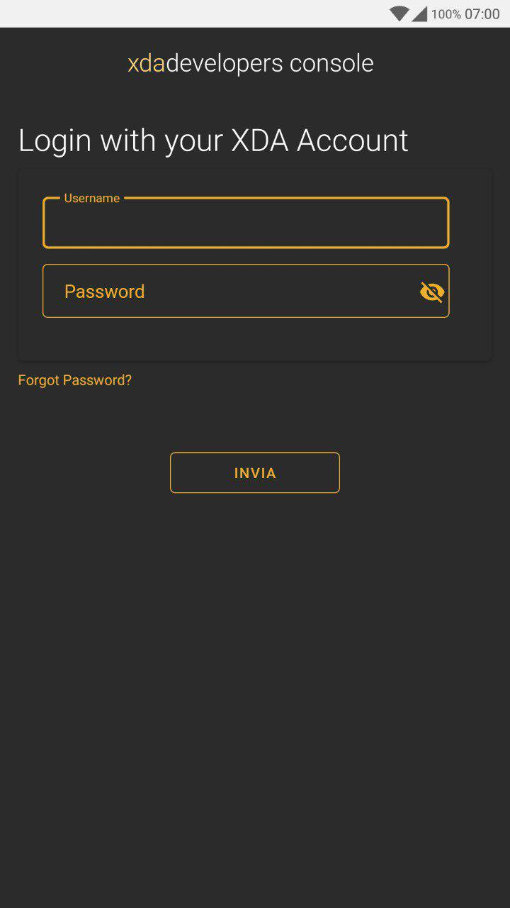
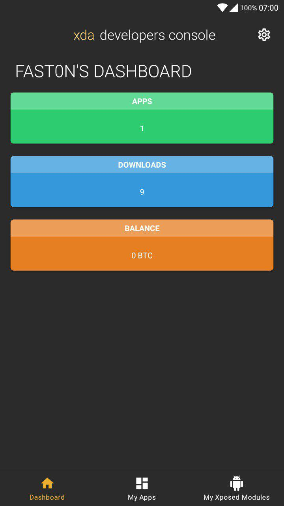
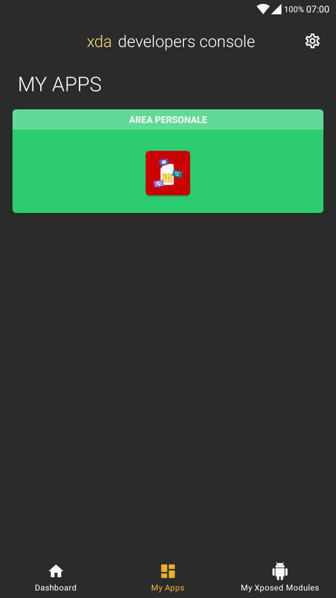
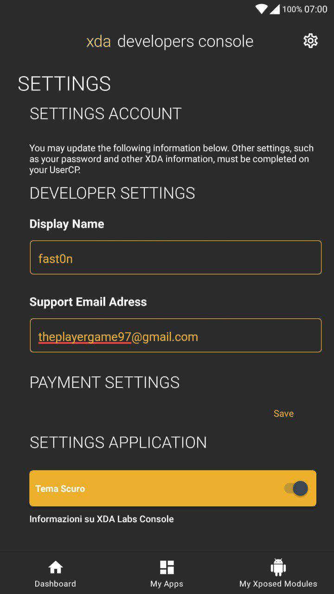

# Xda Developer Console
<a href="https://paypal.me/fast0n" title="Donate"></a>

Xda Developer Console allows you to manage with the app the page https://labs.xda-developers.com/manage/.

## App function

* Login
* Dashboard
* My apps
* Settings

## App screenshot

<a></a>
<a></a>
<a></a>
<a></a>

## API

### get_key

get_key request require no parameters and return the server base64 encode public key to econde the login password.

#### request

```
/get_key
```

#### response

```
{
"key": public_key
}
```

### login

login request require username and password encoded with server public key or bbuserid and bbpassword.
if parameters are username and password return sessionid, bbuserid, bbpassword.
else if the parameters are bbuserid and bbpassword return new session id.

sessioid is used to get access to all https://labs.xda-developers.com/manage/ information.

#### request

```
/login?username={username}&password={password}
```

or

```
/login?bbuserid={bbuserid}&bbpassword={bbpassword}
```

#### response

```
{   
    "bbpassword": bbpassword,
    "bbuserid": bbuserid,
    "sessionid": sessionid
}
```

or

```
{   
    "sessionid": sessionid
}
```

### settings

settings request require sessionid and return https://labs.xda-developers.com/manage/settings input values, page title and if exist the input alert

#### request

```
/settings?sessionid={sessionid}
```
#### response

```
{
    "bitcoin_address": {
        "value": value
    },
    "csrfmiddlewaretoken": {
        "value": value
    },
    "display_name": {
        "value": value
    },
    "paypal_address": {
        "alert": "If you are accepting PayPal, we highly recommend that you explore enabling your account for micropayments, which should reduce the fees you pay to PayPal if your app sells for less than $10.",
        "value": value
    },
    "support_email": {
        "value": value
    },
    "title": "Settings"
}
```

### dashboard

dashboard request require sessionid and return https://labs.xda-developers.com/manage stats (apps, download, balance), page title

#### request

```
/dashboard?sessionid={sessionid}
```

#### response

```
{
    "dashboard": [
        {
            "color": "#2ecc71",
            "name": "Apps",
            "value": "1"
        },
        {
            "color": "#3498db",
            "name": "Downloads",
            "value": "9"
        },
        {
            "color": "#e67e22",
            "name": "Balance",
            "value": "0 BTC"
        }
    ],
    "title": "Fast0n's Dashboard"
}
```

### apps

apps request require sessionid and return page title and list with all apps in https://labs.xda-developers.com/manage/apps/, with color, id, img, name

#### request

```
/apps?sessionid={sessionid}
```

#### response

```
{
    "apps": [
        {
        "color": "#2ecc71",
        "id": "5d826e0d-2b11-403c-9865-e28dc8092bb1",
        "img": "https://labs-public-dl.xda-cdn.com/images/66901801-d08a-490e-b104-8ddebc6d27a9.png",
        "name": "Area Personale"
        }
    ],
    "title": "My Apps"
}
```
